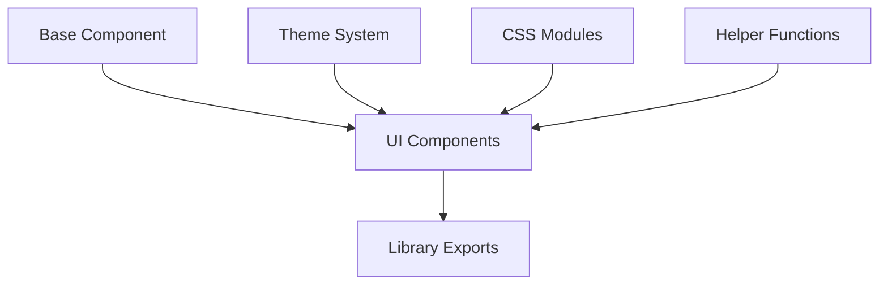
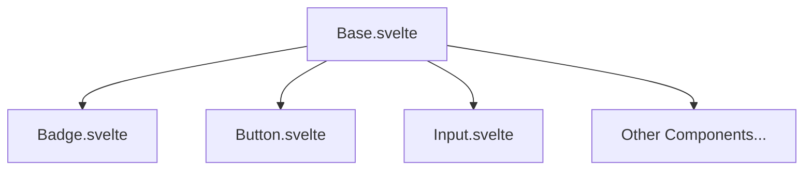
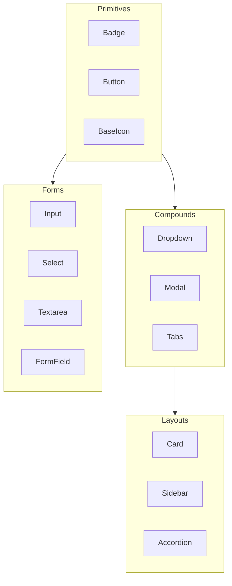
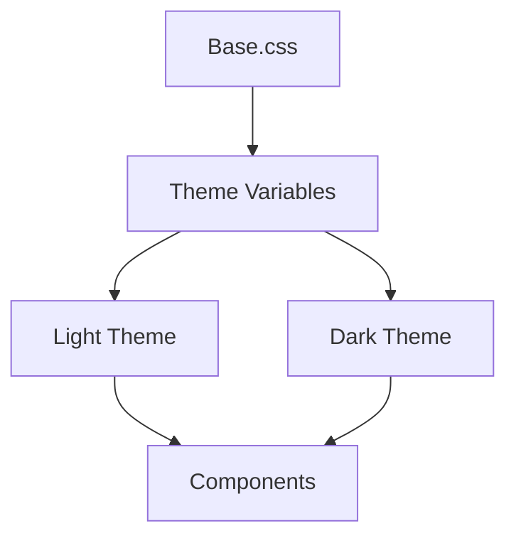

# System Patterns

## Architecture Overview
Veltify follows a component-based architecture with a focus on composability, reusability, and theming. The library is structured to enable tree-shaking and minimal bundle sizes while providing a rich set of UI components.

## Core Design Patterns

### Base Component Pattern
The foundation of the component system is the `Base` component, which:
- Provides a consistent foundation for all UI components
- Handles common functionality like class generation and element rendering
- Supports dynamic tag rendering (div, span, input, etc.)
- Manages binding of values and elements
- Passes through props to the underlying HTML elements

### Component Composition
Components are built using Svelte 5's composition patterns:
- `$props()` for defining and destructuring component props
- `$derived` for computed values
- `$bindable()` for two-way binding
- `{@render}` for rendering slots and children

### CSS Class Generation
The library uses a consistent pattern for generating CSS classes:
- Base class for the component (e.g., `.badge`)
- Variant classes based on props (e.g., `.badge-variant-primary`)
- Size classes when applicable (e.g., `.badge-size-sm`)
- State classes for interactive states

The `cls()` helper function handles the generation of these classes based on component props.

## Component Relationships

### Component Hierarchy
Components are organized in a hierarchy based on complexity:

### Compound Components
Some components use a parent-child pattern for complex UI elements:
- Accordion/AccordionItem
- Card/CardBody
- Carousel/CarouselItem
- Dropdown/DropdownItem
- Modal/ModalContent
- Sidebar/SidebarItem/SidebarMenu
- Tabs/TabItem/TabHeader/TabContent/TabPanel

## Theming System

### Theme Variables
The theming system is built on CSS variables defined in the Base.css file:
- Color variables for different UI elements
- Spacing variables for consistent layout
- Dark mode variants of all color variables

### Theme Application
Themes are applied through:
- CSS variables for colors and spacing
- Tailwind's utility classes for applying the variables
- Component-specific CSS files for component styling
- The `@apply` directive to compose utility classes

## Type System
The library uses TypeScript for type safety:
- Component props are typed
- Helper functions include type definitions
- CSS class generation is type-safe

## Accessibility Patterns
Accessibility is built into the component design:
- ARIA attributes are applied appropriately
- Keyboard navigation is supported
- Focus management is handled for interactive components
- Color contrast meets WCAG 2.1 AA standards
